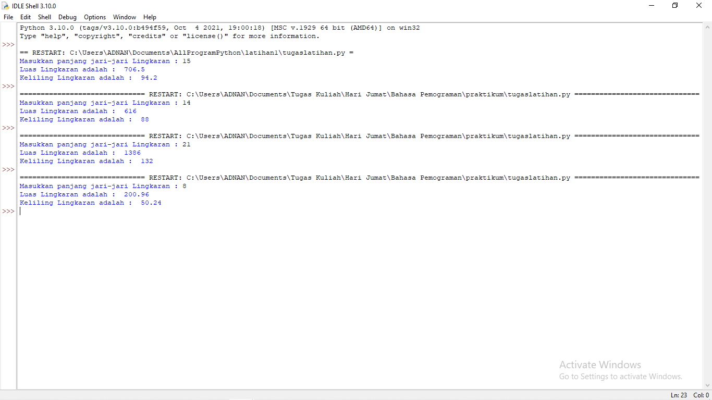

# Penjelasan Program Menghitung luas dan keliling dari lingkaran

## Screen Shoot Hasil Eksekusi Program


#### Syntax Program Python soal menghitung luas dan keliling pada lingkaran
<br>
```sh

kelipatan7 = [7,14,21,28,35,42,49,56,63,70]

r = float(input("Masukkan panjang jari-jari Lingkaran : "))

for nilai in kelipatan7 : 
    if r == nilai : 
        phi1 = 22/7 
        luaslingkaran = phi1 * nilai * nilai 
        kelilinglingkaran = 2 * phi1 * nilai 
        print("Luas Lingkaran adalah : ", int(luaslingkaran)) 
        print("Keliling Lingkaran adalah : ", int(kelilinglingkaran)) 
        break 

if r != nilai : 
        phi2 = 3.14 
        luaslingkaran = phi2 * r * r 
        kelilinglingkaran = 2 * phi2 * r 
        print("Luas Lingkaran adalah : ", float(luaslingkaran)) 
        print("Keliling Lingkaran adalah : ", float(kelilinglingkaran)) 


```
